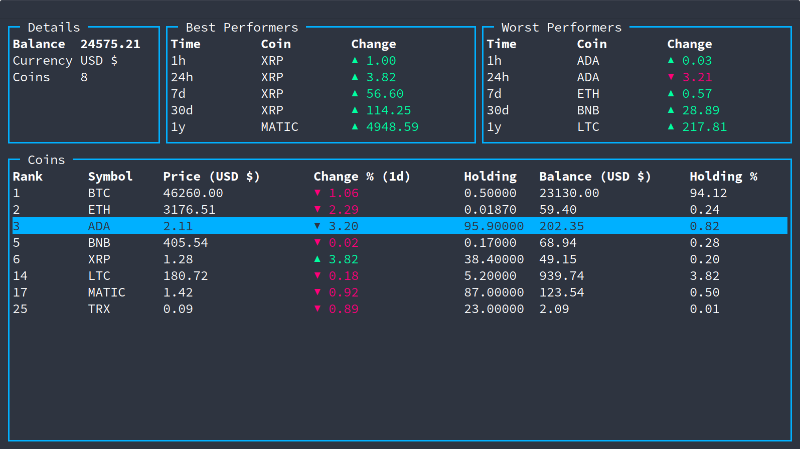
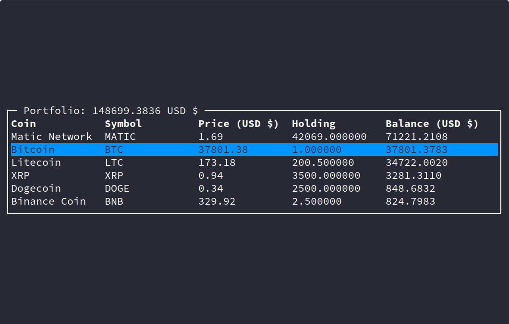
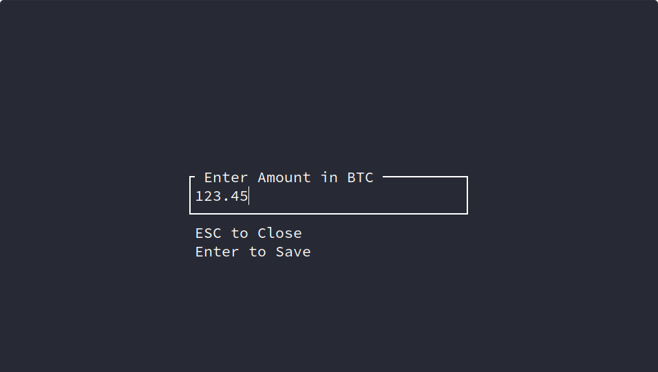
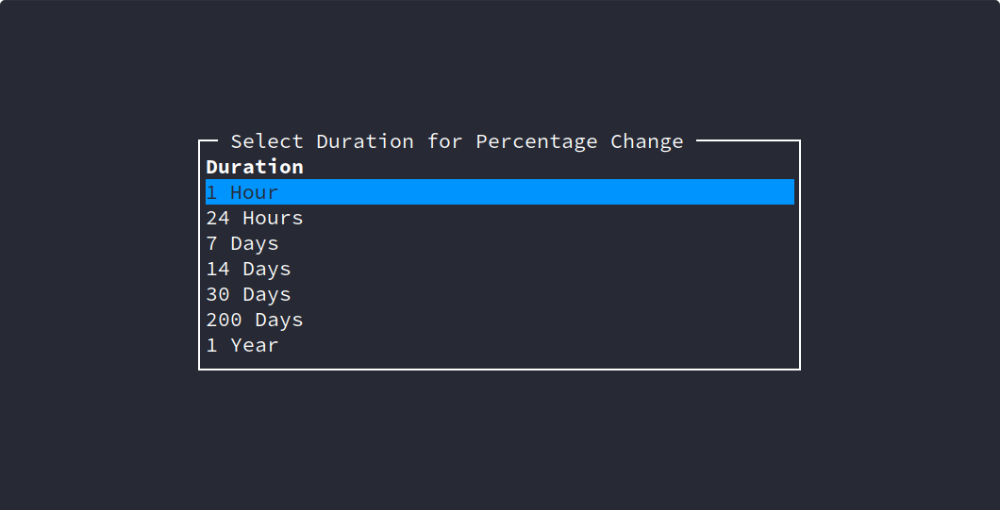
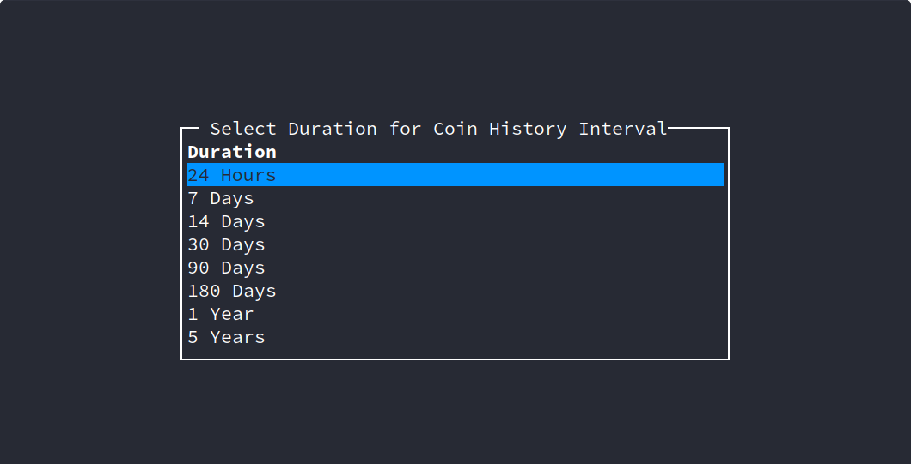

cryptgo
=======

[](https://github.com/Gituser143/cryptgo/actions/workflows/go.yml) [](https://github.com/Gituser143/cryptgo/actions/workflows/license_check.yml)

### Latest Stable Version: `v1.0.0`

Crytpgo is a TUI based application written purely in Go to monitor and observe cryptocurrency prices in real time!


Installation
============

Using Go
--------

```bash
go get -u github.com/Gituser143/cryptgo
```

Using Docker
------------

### Running Image

Replace `<version>` with a specific version for stable builds. Omitting `<:version>` or replacing using `main` as version provides the latest (in development) version.

```bash
# Pull Image
docker pull bhargavsnv/cryptgo:<version>

# Run image
docker run --rm -it -v "$HOME:/home/appuser" bhargavsnv/cryptgo
```

Optionally, an alias can be created for ease of use:

```bash
alias cryptgo='docker run --rm -it -v "$HOME:/home/appuser" bhargavsnv/cryptgo'
```

And run using:

```bash
cryptgo [flags]
# or
cryptgo [command]
```

### Building Image locally

```bash
# Clone the repository
git clone https://github.com/Gituser143/cryptgo

# Navigate into repository
cd cryptgo

# Build image
docker build -t cryptgo .

# Run image
docker run --rm -it -v "$HOME:/home/appuser" cryptgo
```

From source:
------------

Building requires [Go](https://golang.org) to be installed.

```bash
# Clone the repository
git clone https://github.com/Gituser143/cryptgo

# Navigate into repository
cd cryptgo

# Build executable
go build cryptgo.go
```

---

What does `cryptgo` do?
=======================

Cryptgo helps you look at cryptocurrency values, details and track your crypto portfolio straight from your terminal!

It makes use of the API provided by [CoinCap.io](https://coincap.io/) and [CoinGecko](https://www.coingecko.com/en) to provide the required details!

Main Page
---------


-	Here, the top 3 currencies (as ranked by Market Cap) are displayed with their graphs on top.

-	A table is provided with relevant information about other currencies.

-	`cryptgo` allows you to keep track of your favourite currencies by adding them to the favourites table.

-	A selected coin (from either the coin table or favourites) can be further inspected in detail.

### Key-Bindings

Key-bindings can be found by pressing `?`. This displays the help prompt.

-	**Quit**: `q` or `<C-c>`
-	**Table Navigation**
	-	`k` and `<Up>`: up
	-	`j` and `<Down>`: down
	-	`<C-u>`: half page up
	-	`<C-d>`: half page down
	-	`<C-b>`: full page up
	-	`<C-f>`: full page down
	-	`gg` and `<Home>`: jump to top
	-	`G` and `<End>`: jump to bottom
	-	`f`: focus favourites table
	-	`F`: focus interval table
-	**Sorting**
	-	Use column number to sort ascending.
	-	Use `<F-column number>` to sort descending.
	-	Eg: `1` to sort ascending on 1st Col and `F1` for descending
-	**Actions (Interval Table)**
	-	`<c>`: Select Currency (from popular list)
	-	`<C>`: Select Currency (from full list)
	-	`e`: Add/Edit coin to Portfolio
	-	`P`: View portfolio
	-	`<s>`: Star, save to favourites
	-	`<S>`: UnStar,remove from favourites
	-	`<Enter>`: View Coin Information
	-	`%`: Select Duration for Percentage Change

Coin Page
---------


-	The coin page give more in depth details of a particular coin.

-	It can be navigated to from either the favourites or coin table.

-	The price history is displayed on top and can be viewed through different intervals, as provided by the Graph Interval table on the bottom left.

-	A live price is streamed in the price box and additional details are described in the details table.

### Key-Bindings

Key-bindings can be found by pressing `?`. This displays the help prompt.

-	**Quit**: `q` or `<C-c>`
-	**Table Navigation**
	-	`k` and `<Up>`: up
	-	`j` and `<Down>`: down
	-	`<C-u>`: half page up
	-	`<C-d>`: half page down
	-	`<C-b>`: full page up
	-	`<C-f>`: full page down
	-	`gg` and `<Home>`: jump to top
	-	`G` and `<End>`: jump to bottom
	-	`f`: focus favourites table
	-	`F`: focus interval table
-	**Sorting**
	-	Use column number to sort ascending.
	-	Use `<F-column number>` to sort descending.
	-	Eg: `1` to sort ascending on 1st Col and `F1` for descending
-	**Actions (Interval Table)**
	-	`<Enter>`: Set Interval
	-	`<c>`: Select Currency (from popular list)
	-	`<C>`: Select Currency (from full list)

Portfolio Page
--------------



-	Cryptgo allows you to track your crypto portfolio through a separately defined page.

-	This page can be accessed with the command `cryptgo portfolio`.

### Key-Bindings

-	**Quit: `q` or `<C-c>`**
-	**Table Navigation**
	-	`k` and `<Up>`: up
	-	`j` and `<Down>`: down
	-	`<C-u>`: half page up
	-	`<C-d>`: half page down
	-	`<C-b>`: full page up
	-	`<C-f>`: full page down
	-	`gg` and `<Home>`: jump to top
	-	`G` and `<End>`: jump to bottom
-	**Sorting**

	-	Use column number to sort ascending.
	-	Use `<F-column number>` to sort descending.
	-	Eg: `1` to sort ascending on 1st Col and `F1` for descending

-	**Actions**

	-	`c`: Select Currency (from popular list)
	-	`C`: Select Currency (from full list)
	-	`e`: Add/Edit coin to Portfolio
	-	`<Enter>`: View Coin Information

### Mini Portfolio



-	Cryptgo also allows you to view your holdings through a mini portfolio from other pages.

-	Coins can be added/modified/removed by pressing `e` on a coin in the main page. (Set Holding Amount as 0 to remove)

-	Holdings can be modified either through the main page or through the portfolio itself. The below image shows the edit box when modifying holdings.



Utilities
---------

### Currency

Currency need not be fixed to USD $, other currencies can be selected from either the popular currency table (press `c`) or full currency table (press `C`).

#### Popular Currency Table


#### Full Currency Table


### Change Percentage Interval

The Change Percentage on the main page can be modified too. A list of durations can be viewed and selected by pressing `%`, which brings up the below table.



### Change Graph Duration

The duration of the history graph on the coin page is modifiable. To list the possible durations and select one, press `d` in the coin page. that will bring up the following table.



---

Contributing
============

**Pull Requests and Issues are welcome!**

Please check the issues page to see available issues to work on, or to even create some!

---

Credits
=======

Multiple Design ideas, utilities, functions and practices have been adopted from:

-	[Grofer](https://github.com/pesos/grofer)

-	[Gotop](https://github.com/cjbassi/gotop)

-	[Termui](https://github.com/gizak/termui)

Do check them out!
