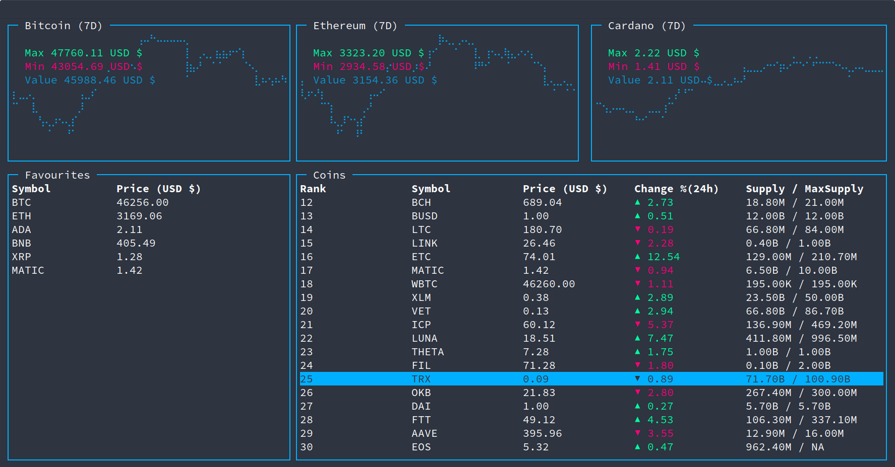
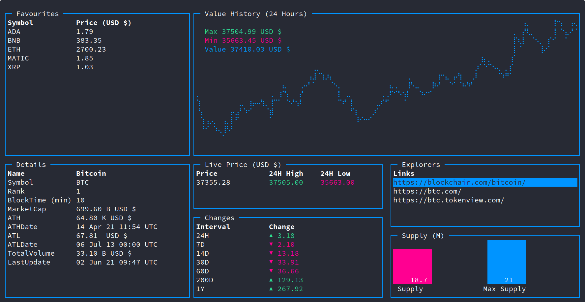
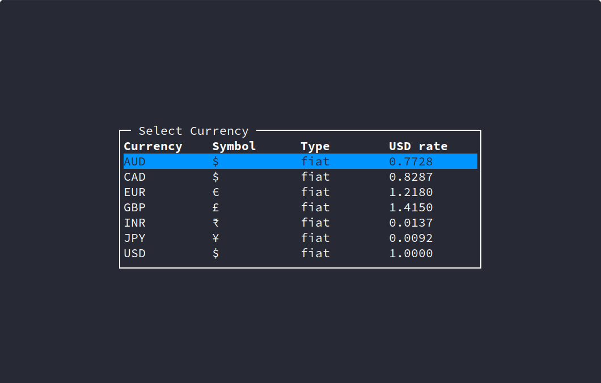
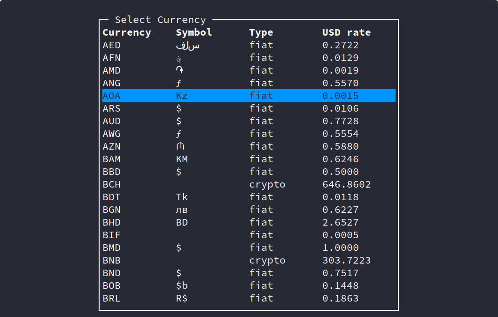

cryptgo
=======

Crytpgo is a TUI based application written purely in Go to monitor and observe cryptocurrency prices in real time!

Installation
============

Using Go
--------

```bash
go get -u github.com/Gituser143/cryptgo
```

From source:
------------

Building requires [Go](https://golang.org) to be installed.

```bash
git clone https://github.com/Gituser143/cryptgo
cd cryptgo
go build cryptgo.go
```

---

What does `cryptgo` do?
=======================

Cryptgo helps you look at cryptocurrency values and details straight from your terminal!

It makes use of the API provided by [CoinCap.io](https://coincap.io/) to provide required details!

Main Page
---------



-	Here, the top 3 currencies (as ranked by CoinCap) are displayed with their graphs on top.

-	A table is provided with relevant information about other currencies.

-	`cryptgo` allows you to keep track of your favourite currencies by adding them to the favourites table.

-	A selected coin (from either the coin table or favourites) can be further inspected in detail.

### Key-Bindings

Key-bindings can be found by pressing `?`. This displays the help prompt.

-	**Quit**: `q` or `<C-c>`
-	**Table Navigation**
	-	`k` and `<Up>`: up
	-	`j` and `<Down>`: down
	-	`<C-u>`: half page up
	-	`<C-d>`: half page down
	-	`<C-b>`: full page up
	-	`<C-f>`: full page down
	-	`gg` and `<Home>`: jump to top
	-	`G` and `<End>`: jump to bottom
	-	`f`: focus favourites table
	-	`F`: focus interval table
-	**Sorting**
	-	Use column number to sort ascending.
	-	Use `<F-column number>` to sort descending.
	-	Eg: `1` to sort ascending on 1st Col and `F1` for descending
-	**Actions (Interval Table)**
	-	`<s>`: Star, save to favourites
	-	`<S>`: UnStar,remove from favourites
	-	`<Enter>`: View Coin Information
	-	`<c>`: Select Currency (from popular list)
	-	`<C>`: Select Currency (from full list)

Coin Page
---------



-	The coin page give more in depth details of a particular coin.

-	It can be navigated to from either the favourites or coin table.

-	The price history is displayed on top and can be viewed through different intervals, as provided by the Graph Interval table on the bottom left.

-	A live price is streamed in the price box and additional details are described in the details table.

### Key-Bindings

Key-bindings can be found by pressing `?`. This displays the help prompt.

-	**Quit**: `q` or `<C-c>`
-	**Table Navigation**
	-	`k` and `<Up>`: up
	-	`j` and `<Down>`: down
	-	`<C-u>`: half page up
	-	`<C-d>`: half page down
	-	`<C-b>`: full page up
	-	`<C-f>`: full page down
	-	`gg` and `<Home>`: jump to top
	-	`G` and `<End>`: jump to bottom
	-	`f`: focus favourites table
	-	`F`: focus interval table
-	**Sorting**
	-	Use column number to sort ascending.
	-	Use `<F-column number>` to sort descending.
	-	Eg: `1` to sort ascending on 1st Col and `F1` for descending
-	**Actions (Interval Table)**
	-	`<Enter>`: Set Interval
	-	`<c>`: Select Currency (from popular list)
	-	`<C>`: Select Currency (from full list)

Extra
-----

Currency need not be fixed to USD $, other currencies can be selected from either the popular currency table (press `c`) or full currency table (press `C`).

### Popular Currency Table



### Full Currency Table



---

Contributing
============

**Pull Requests and Issues are welcome!**

---

Credits
=======

Multiple Design ideas, utilities, functions and practices have been adopted from:

-	[Grofer](https://github.com/pesos/grofer)

-	[Gotop](https://github.com/cjbassi/gotop)

-	[Termui](https://github.com/gizak/termui)

Do check them out!
